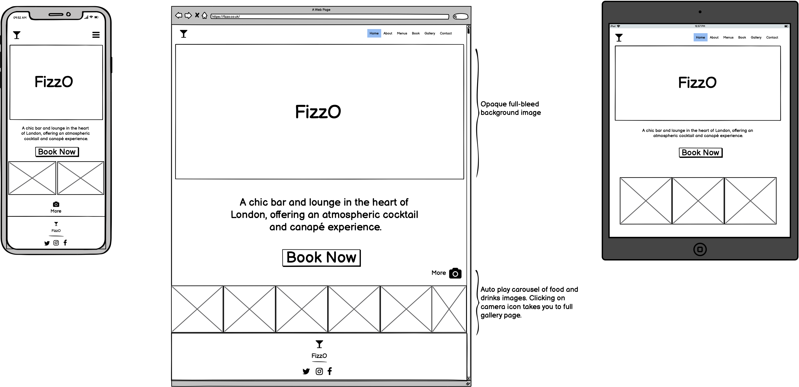
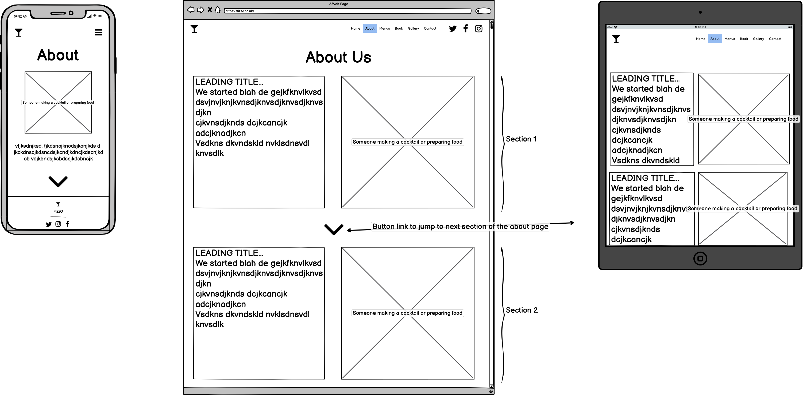
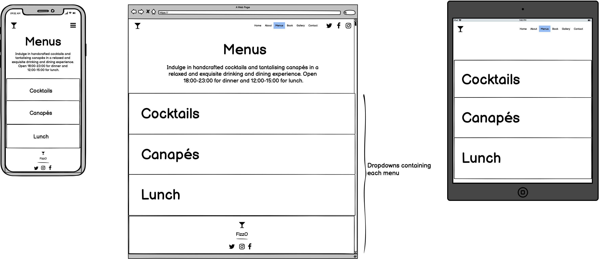
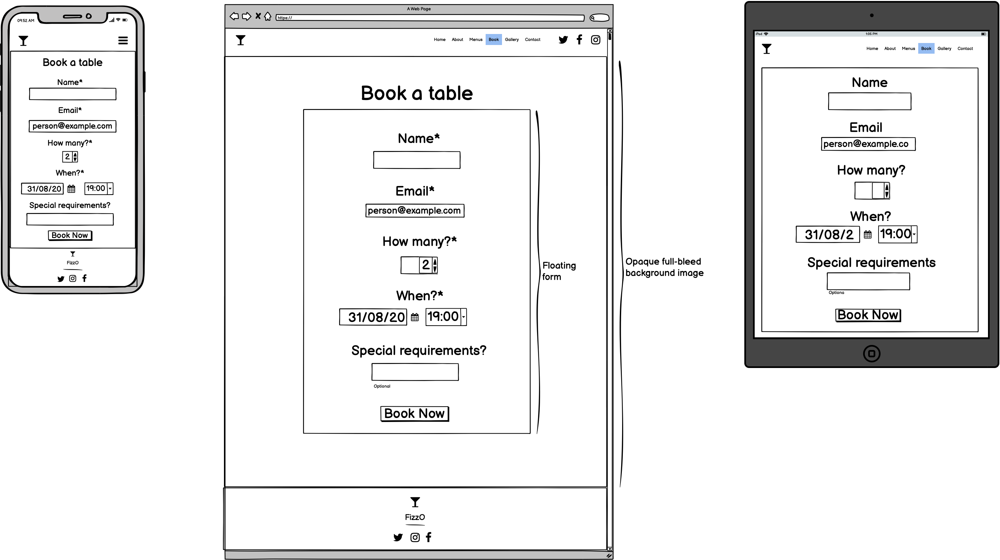
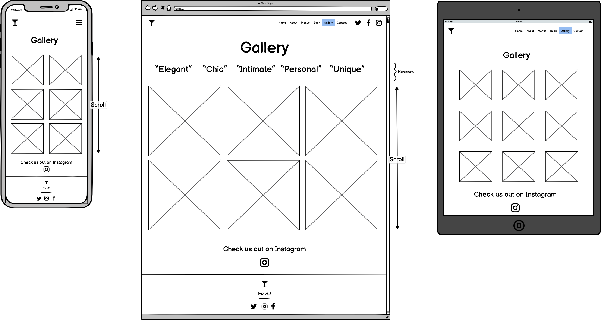
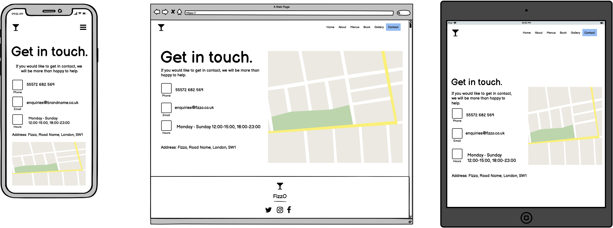
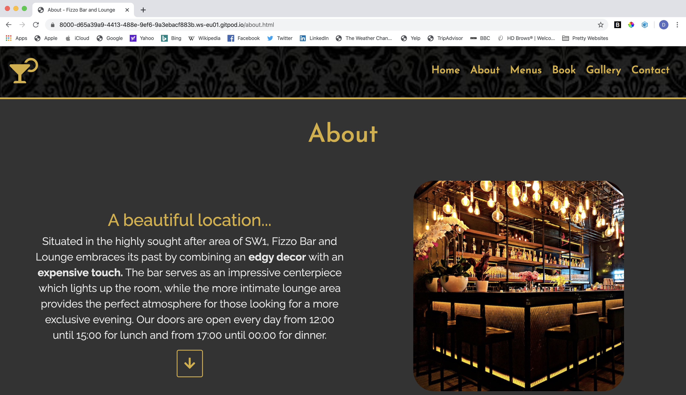
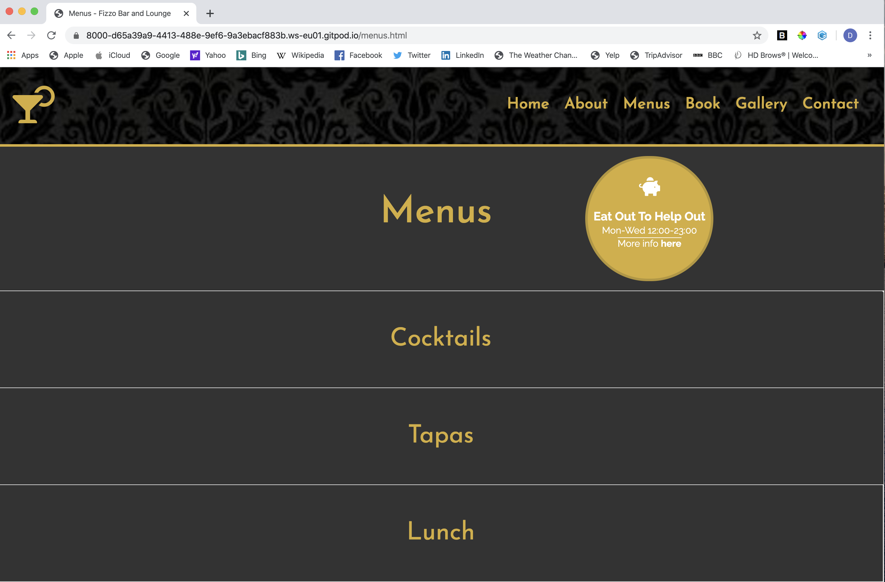
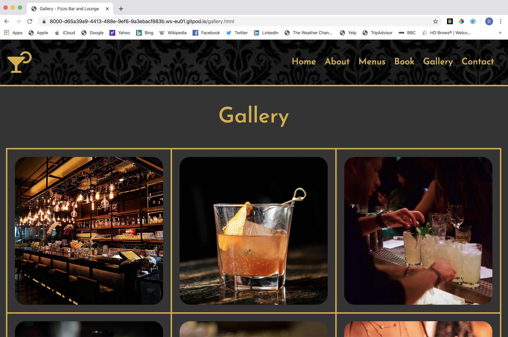
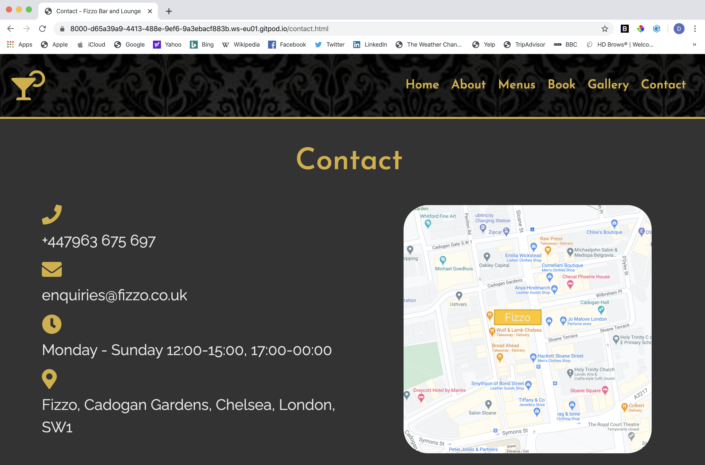

# Fizzo Bar and Lounge (Milestone Project 1)

This project is a website for a bar and lounge which serves cocktails and tapas in  casual yet classy surroundings. The aim of the website is to produce a higher conversion rate of visits to table bookings, and thus higher profits. The live version of my project can be accessed here: https://daisybutler.github.io/Fizzo-Bar-and-Lounge-ci-project01/

------
## UX
The customer needs to find the process of navigating the site as simple as possible. Although a fundamental feature, this is not always to make a booking. Accessing menus and viewing the gallery are important parts of the process leading up to the conversion to a booking. Text should be minimal with a focus on stylish imagery to maintain the interest and focus of the site visitor.

The owner's aim for the website is to secure table bookings via the website to increase revenue. The website will do this by a) making the booking process quick and simple for someone who wishes to book; b) selling the dining experience (classy, stylish, upmarket, relaxed) to a site visitor who is yet to make a decision to book.

### User Stories:
- As a potential customer, I want be impressed by the look and style of the website for the bar.

- As a potential customer, I want to access the menu to see what drinks and food are offered.

- As potential customer, I want to view photos of the bar and lounge so I can see what the bar and lounge looks like.

- As a customer who wishes to make a booking, I want to engage in a straightforward process to book a table.

- As a customer with a query not covered by the website, I want to know where I can reach out for further infomation.

- As the owner of the site, I want my business to strongly appeal to potential customers so that the experience manifests itself as greater than the cost.

------

## Features
**Home:** must immediately convey the atmosphere of the bar and lounge - stylish and a classy. Call to action (book) and a clear navbar to access the about, menus, gallery and contact tabs.

**About** Clearly sets out the location and services offered at the bar and lounge in an easy to read manner. 

**Menus:** one click access to dropdowns of each menu with attention drawn to any existing offers. 

**Book:** one page form to allow customers to submit a booking request online. All fields which are required to prevent an incomplete booking notify the user if they try to submit the form without these fields completed.

**Gallery:** displays product and service in a simple and clean format. There is a link to bar's Instagram page should the user wish to see more photos. 

**Contact:** caters for a minority of site visitors who are there for something other than booking or browsing. Contact options ensure potential customers are not lost should they have a query which needs answering before they book.

### Colours:
The colour scheme for this website is a dominant colour of dark grey #333333 with fonts of gold #d4af37 and a light grey/silver #e3e5e4.Some section are white #ffffff for visual contrast and clarity. These neutral tones allow for the colourful images to stand out.

-----
## Technologies Used
[Bootstrap](https://getbootstrap.com/): to optimise and speed up the process of styling site with CSS.

[Fontawesome](https://fontawesome.com/): provides useful icons for intutive user experience. 

[Unsplash](https://unsplash.com/): source of the stock images used throughout the website. 

-------

## Testing
### Code Validation

I used [https://validator.w3.org/nu/](https://validator.w3.org/nu/) to validate my code. It raised several issues with child p elements which couldn't be used with divs when labelled as 'p1', 'p2' etc. I had also not given a section a heading tag as a direct child in the jumbotron. It also raised an error with using p elements as children of span in the badge on the menu page. I replaced the p elements with more spans to fix this. 

### Satisfying user stories

As the owner of the bar and lounge, I can see that the website is set out in a clean and orderly fashion with easy access to every feature a potential customer may wish to explore in the navbar at the top. There are plenty of images of the bar and the colour scheme and layout successfully reflect the stylish feel of it.

A potential customer can find out about the restaurant and its unique selling point by visiting the About tab. The page is divided into three sections of information - the location, the drinks and food served and the occasions the venue is suited for. Access to next steps are also provided. The breakdown into sections, with clickable navigation to the next section on larger screens, reduces textual overload for the user. Corresponding images for each section helps to illustrate each section's focus.

A potential customer can find out the exact food and drinks on offer by navigating to the Menus tab. Three collapsable sections - cocktails, tapas and lunch - provide a clean layout. One section can only be toggled at a time to prevent too much text on the screen at any given time and causing a visual overload. The offer badge in the top right provides an incentive to make a booking. To reduce on-screen clutter, this is only present on larger screens. The endnote regarding dietary requirements makes the potential customer aware of the restaurants capabilities before they commit to booking in order to avoid disappointment. 

A customer who wishes to make a booking can do so by navigating to the Book tab. A form is displayed in a clean and simple format to ensure simplicity for the user. The fields which are essential for the bar to receive in order to register a booking - name, email, number of guests, date and time - are all required fields. The optional field - special requirements - is a feature which accommodates for the customer should they have anything they would like to add. The background image was specifically chosen to depict people at the bar; subconsciously this might suggest the popularity, and thus good quality, of the bar to the potential customer and increase the likelihood that they will complete the booking. 

A potential customer can find out what the bar and lounge and food looks like by visiting the Gallery tab. Photos are displayed in a simple and spaced format, with rows of 2 for smaller screens and rows of 3 for larger screens, to avoid the look of 'cramming'. A link to further photos is provided at the bottom via social media should the customer wish to investigate further. 

A potential customer can easily reach out with a query by navigating to the Contact tab. They can choose their preferred form of contact from the range offered. The icons highlight intuitively what each method of contact is. 

### Responsive behaviour

Home: at default and small, the introduction and September update box appear stacked upon each other. At medium and above they appear side-by-side. The carousel also stacks at small or less screens but appears side-by-side on medium screens and larger. 

About: each section stacks the image on top of the caption on small screens and less. On medium and above the caption appears on the left and the image on the right. On large screens and above, buttons to navigate to the section below appear, with a return to top button on the last section. The font size also increases. 

Menus: on small screens and less, the menu items in the collapsable link appear in one column to make sure the font is large enough to read would looking cramped. On medium screens and above, the items appear in three columns. On small screens and less, the offer badge disappears to avoid clutter. 

Book: The booking form fields remain the the same position on all screen sizes to ensure the booking process looks the same each time for the customer on whatever device they are using. The background image scales accordingly, ensuring the focal point is always the center. 

Gallery: On small screens and less, the photos in the gallery appear in columns of two. On medium screens and above they appear in rows of three to ensure the images do not scale too large and appear overbearing in size. 

Contact: On small screens and less, the contact information is centered in one column on the screen and the map appears below. On a medium screen the text aligns to the left and the map occupies half the row on the right. On large and above, the font size of the contact info increase so as to remain readable and the map continues to scale up. However is is limited to 500x500px to ensure it remains in proportion with the contact info column should the page be loaded on an extra-large screen.

Navbar: the navbar collapses into a toggleable dropdown menu in screen sizes of small and less. This makes the site clean to view on screens which which have limited space.

### Interactivity

**Sitewide**

Navbar: each tab changes to a slightly darker gold colour on hover and links to the corresponding page.

Navbar brand: the cocktail logo in the header takes the user back to the homepage when clicked.

Footer: the social icons link to the homepage of each platform in the abscence of a real brand page. The target is set to _blank to ensure the user does not have to navigate away from the website. 

**Home**

Book now homepage: the homepage call to action inverts its colours on hover, making the background gold and the font colour white. Clicking the anchor, which is modified with the button class, leads the user to the booking page.

Update homepage box: the September 2020 update box is entirely clickable and leads the user to the menus page. Here a badge is present with the Eat Out To Help Out scheme details (this is a real scheme which we had in the UK after lockdown, however it is no longer active).

Carousel: the carousel is set to autoplay but the user can choose to navigate it themselves using the prev and next icons on each side. The images are enclosed in an anchor so that, if a user chooses to click on an image, it will link them through to the gallery page where more photos can be viewed. 

**About**

Section navigation buttons: the button below section 1 scrolls the user down automatically to section 2 when clicked, and similarly from section 2 to section 3. Section 3's button returns the user to the top of the page. The href is #logo rather than #about-section-1 to ensure the navbar is visible to the user. 

Section 3 links: the text 'book a table' and 'contact us' are linked to the Book and Contact tabs respectively, to provide easy access to making a booking upon finishing reading the about section. Hovering does not trigger a change since the colour change on this links to the rest of the text intuitively indicates this.

**Menus**

Badge: the offer badge has a clickable link to the government scheme it is referring to. The target is set to _blank to avoid the user navigating away from the website. Hovering over the link does not trigger an effect because the bold font weight of the text intuitively signals its action to the user. I also wanted minimal visual activity for such a small feature to avoid "busyness".

Accordion: for the menu collapse sections, the aria-expanded value is set to "false" so that the page loads with all sections collapsed. This makes the page look far cleaner for better UX and navigation.

Individual menus: the heading of each collapsing menu changes to a darker shade of gold to signal to the user to click it. On both .btn-link:hover and .btn-link-focus, text decoration is set to none, since the closing procedure should be intuitive for the user once they have learnt how to open it so decoration is not needed. Only one menu can be opened at a time to reduce clutter on the page and maintain visual simplicity.

### Debugging
Unclickable fields: the input fields for name and email where originally not clickable. I checked the code several times and only realised this was a sit wide issue when the "more info' link on the badge on the menus page did not work, nor did the menu collapsable link when centered (when it did on the left). Dev tools revealed it was the navbar dropdown causing the issue (see below).

Navbar for smaller screens: the container for the navbar smaller screen dropdown, although not active on medium screen and above, was rendered on larger screens invisibily. This mean that on clickable items on the screen which fell within its reach could not be clicked on, for example, the first two field of the booking form. If i change the z-index of the navbar drop down to less than that of the screen, then when the browser collapsed to a smaller screen, the toggled navbar would appear behind the page. I fix this bug by removing the z-index for the navbar altogether, but adding a media query which gave it a higher z-index on small screens and less only. 

Carousel: I had trouble with the carousel in terms of rendering the correct proportions of images. I solved this by putting the set widths of the images in the html rather than css. I struggled to find  how to render it with multiple items at a time. Initially I wanted it to show multiple items at a time and advance one at a time. I ended up settling for advancement of three each time because I believe my research suggested more advanced Javascript was necessary for this than I have the knowledge of at the moment. 

About sections: I had trouble with the positioning of the about captions and images so that they remained inline with each other as they scaled down. I solved this using container-fluids and a host of media queries adjusting the padding and text and image sizes with scaling. The idea was to have each section 100vh for clarity and division, hence the button navigation. I think i got this idea to render adequately but I did choose to use less than 100vh for each because the header needed to be included in the browser view of the first section and excess of empty space between sections was not desirable.

Deployment: Having deployed my project to GitHub pages, all pages, except the initial page loaded when I clicked the published link to site, were returning the 404 error "page does not exist". Having noticed that whenever I tried to navigate to a page, the section in the browser URL which contained my repository name disappeared, i tried manually entering the URL to include it. E.g. /fizzo-bar-and-lounge-ci-project01/about.html. This returned the page I was expecting so I realised that the page was indeed published, but must not have the correct file path pointing to it. I looked on Slack and found the suggestion to check my file paths were relative rather than absolute. Using a Youtube tutorial (see credits), I understood how I needed to change my file paths. Looking at my code this did seemed to be the problem and I updated every incorrect absolute file path to relative throughout my html files. 

-----

## Deployment
Having pushed my repository to GitHub, I published the project on GitHub pages. To do this, I check that all of my folders and files had been successfully pushed to GitHub. Then on the repository's settings, I went to the section titled GitHub pages and selected branch:master/(root) then clicked save. Clicking on the published link provided by GitHub pages, I confirmed that the site was up and running. 

If another developer wanted to create a copy of my code to work on on their own the machine, they could do so with the following steps. On my repository's main page on GitHub, click the 'Code' green download button to the top right of the list of files. To clone using HTTPS, click 'Clone with HTTPS', and to use an SSH key, click "use SSH'. Then click the copy to clipboard icon on the right hand side of the link it produces. Opening the terminal, change the cwd to the location you want the cloned repository to appear in. Enter 'git clone' into the terminal followed by the URL copied to clipboard and press enter. The repository is now a local clone. 

If a developer wanted to clone the repository to GitHub desktop, they would follow the same steps as above, but rather than choosing either HTTPS or SSH, they would click 'Open with GitHub desktop' and follow the prompts is to how to clone from there.

----

## Credits
### Content
[Hero image display](https://css-tricks.com/perfect-full-page-background-image/): To make the display of the hero image even and nicely rendered.

[Carousel](https://medium.com/wdstack/bootstrap-4-custom-carousel-94a537364fde): in addition to Bootstrap's code for their carousel, this site helped me render it with multiple images, rather than the default one at a time which bootstrap gives. 

[Accordion](https://getbootstrap.com/docs/4.5/components/collapse/#accordion-example): Bootstrap's accordion code used for the collapsable menu tabs.

[Accordion toggled](https://stackoverflow.com/questions/56106381/bootstrap-collapse-text-decoration): Text decoration would only render as none once this site suggested .btn-link:focus also ought to be set as text-decoration:none.

[About images stack order](https://stackoverflow.com/questions/32170406/how-to-change-order-of-divs-on-smaller-screens): source helped me render the images on about.html above captions on smaller screens but on the right hand side (i.e. underneath) the caption on larger screens using the 'order' property.

[Styling next and prev icons on carousel](https://stackoverflow.com/questions/46249541/change-arrow-colors-in-bootstraps-carousel): targeting the Bootstrap class for next and prev items rendered no style change so this site suggested overriding the default icons with ones from Font Awesome and targeting those.

[Understanding relative file paths to fix an initial deployment issue](https://www.youtube.com/watch?v=ephId3mYu9o): this tutorial helped me to understand the changes I needed to make to the various file paths I had throughout my site which had made GitHub pages unable to publish it. 

### Media
All images were obtained from [Unsplash](https://unsplash.com/).

### Acknowledgements
This project received inspiration from [The Alchemist](https://thealchemist.uk.com/) and [Coya](https://www.coyarestaurant.com/mayfair/) restaurant websites. 
